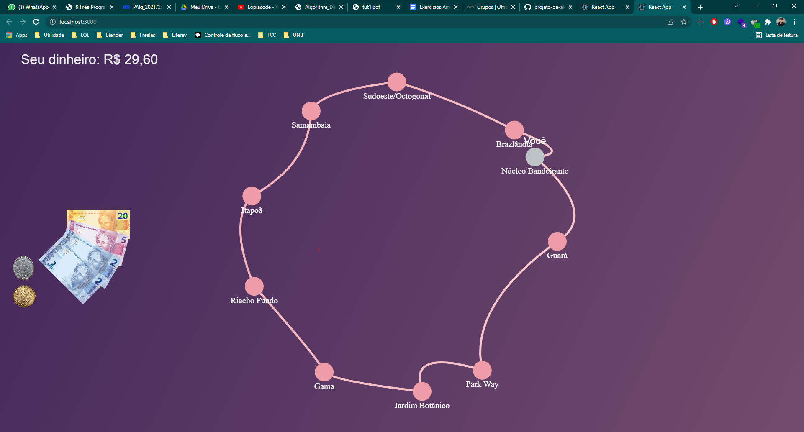

# Rolê por BSB

## Sobre 
O  aplicativo é um protótipo de game onde o algoritmo ambicioso do trocador é utilizado para decompor o dinheiro do usuário em cedulas/moedas de real.

## Screenshots

## Instalação 
**Linguagem**: Javascript 
**Framework**: React/Canvas 

Pré-requisitos: Node v17.4.0

### Instalação:
* Execute o comando `npm install -g yarn`
* Vá até o diretorio do projeto e digite `yarn install`
* Após a conclusão da instalação, execute o comando `npm start`
